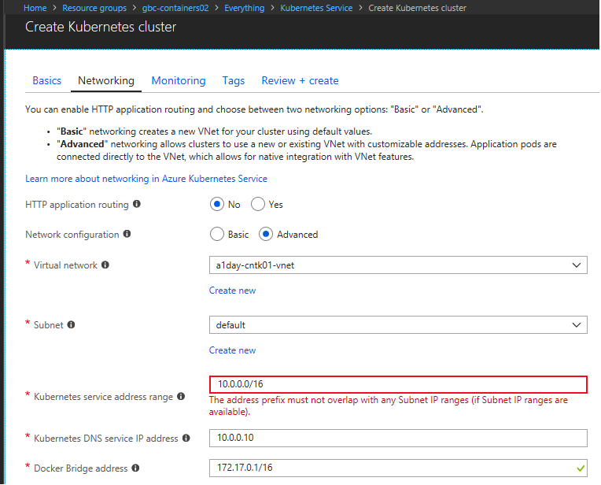

### Quick Summary of AKS Cluster Deployment Pre-Requisites using new Advanced Networking

1. A **Service Principal** is required for all AKS deployments.  If your Azure Subscription/User Policies allow you to create a Service Principal, AKS will automatically create one for you if not specified.  However, most Azure Admin's will lock down this capability.  As a result, it is a best practice to first create an Azure AD Application and then create a new Service Principal associated to the Azure AD Application.  See the following documentation for a full description of the options & technical considerations - https://docs.microsoft.com/en-us/azure/aks/kubernetes-service-principal
2. **Vnet/Subnet** combination to be used with AKS needs to be pre-created in a **Resource Group** of your choice.  Make sure the Service Principal created in Step 1 has **Contributor** permissions in the target Resource Group.  Review the AKS Networking requirements and technical constraints to get an overview AKS networking architecture - https://docs.microsoft.com/en-us/azure/aks/networking-overview.
3. Next create the Vnet and AKS Subnet either via the Azure Portal or CLI (examples in the doco above).  Note that creating an AKS Cluster using **Advance Networking** features can only be deployed via the **Azure Portal** or with an **ARM template** at present.
4. The AKS Cluster is now ready to be created using **Advance Networking**, it recommended using the Azure Portal the 1st time in your environment.  Again, make sure the **Service Principal** created in Step 1 has **Contributor** permissions in the target Resource Group.  Follow the prompts in the Azure AKS Create Blade(s) in the Azure Portal.  Use the defined Service Principal on the 1st Blade, and fill in the Vnet/Subnet information on the 2nd/Networking Blade.  An example is shown below, it is recommended that a different SubNet IP range be used for the **Kubernetes Service/Service DNS** specification (e.g. if Vnet/Subnet is 10.x.x.x use 172.x.x.x).  Use the default for the **Docker Bridge** definition unless your Azure Admin/Networking team has identified any potential conflicts with the AKS & Kubernetes Service Subnets.

5.  Follow the prompts on the remaining Blades, it's encouraged to enable the **Health/Monitoring and Logging** to ensure all AKS Telemetry is available for your Operations and Development teams.  A **Log Analytics workspace** is required, which will be created by default or can be pre-created.  
6.  Once your AKS Cluster has been successfully deployed, review the documentation on creating an Internal Loadbalancer to expose Kubernetes Services on the defined Vnet - https://docs.microsoft.com/en-us/azure/aks/internal-lb.  Additional resources for **Ingress/TLS, Egress Traffic, and HTTP Application Routing** are available and should be reviewed depending on Network Routing requirements:

https://docs.microsoft.com/en-us/azure/aks/ingress

https://docs.microsoft.com/en-us/azure/aks/egress

https://docs.microsoft.com/en-us/azure/aks/http-application-routing
